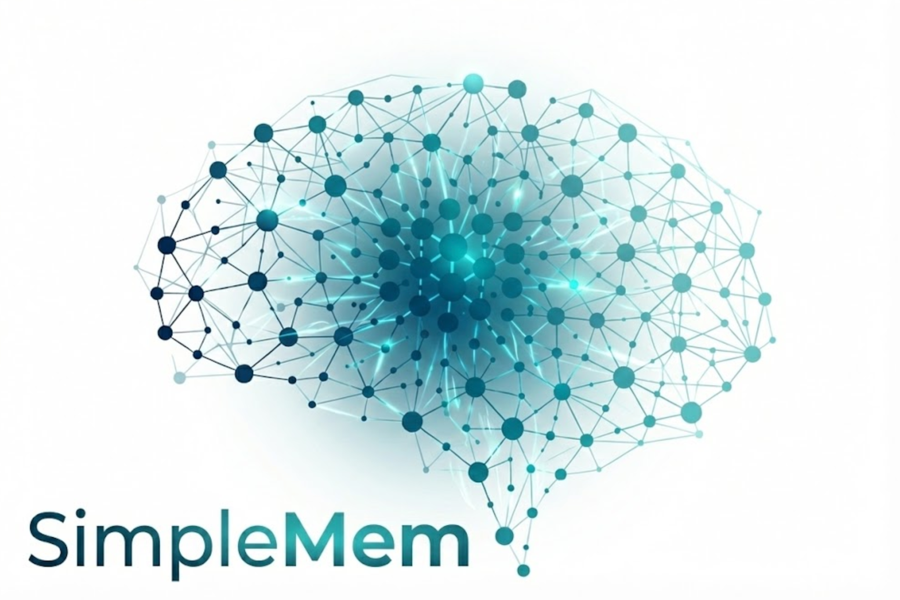
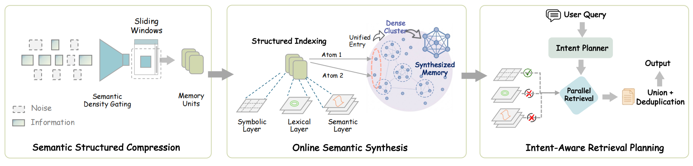

# SimpleMem: Efficient Lifelong Memory for LLM Agents

<div align="center">

<p align="center">
  
</p>


[](https://aiming-lab.github.io/SimpleMem-Page)

[](https://arxiv.org/abs/2601.02553)
[](https://github.com/aiming-lab/SimpleMem)
[](LICENSE)

</div>

---

## 🔥 News
- **[01/20/2026]** **SimpleMem is now available on PyPI!** 📦 You can now install SimpleMem directly via `pip install simplemem` for easier setup and integration. [View Package Usage Guide →](docs/PACKAGE_USAGE.md)
- **[01/19/2026]** **Added Local Memory Storage for SimpleMem Skill!** 💾 SimpleMem Skill now supports local memory storage, enabling seamless memory retention and management directly within Claude Skills.
- **[01/18/2026]** **SimpleMem now supports Claude Skills!** 🚀 Use SimpleMem in claude.ai to remember long-term information and project history across conversations. Register at [mcp.simplemem.cloud](https://mcp.simplemem.cloud), add the domain to Claude's network whitelist, **configure with your token in the skill file**, and import the skill!
- **[01/14/2026]** **SimpleMem MCP Server is now LIVE and Open Source!** 🎉 Experience SimpleMem as a cloud-hosted memory service at [mcp.simplemem.cloud](https://mcp.simplemem.cloud). Easily integrate with your favorite chat platforms (LM Studio, Cherry Studio) and AI agents (Cursor, Claude Desktop) using the **Streamable HTTP** MCP protocol. The MCP implementation features production-ready optimizations including multi-tenant user isolation, faster response times, and enhanced security. [View MCP Documentation →](MCP/README.md)
- **[01/08/2026]** We've set up a Discord server and WeChat group to make it easier to collaborate and exchange ideas on this project. Welcome to join the Group to share your thoughts, ask questions, or contribute your ideas! 🔥 Join our [Discord](https://discord.gg/KA2zC32M) and [WeChat Group](fig/wechat_logo3.JPG) Now!
- **[01/05/2026]** SimpleMem paper was released on [arXiv](https://arxiv.org/abs/2601.02553)!

---

## 📑 Table of Contents

- [🌟 Overview](#-overview)
- [🎯 Key Contributions](#-key-contributions)
- [🚀 Performance Highlights](#-performance-highlights)
- [📦 Installation](#-installation)
- [⚡ Quick Start](#-quick-start)
- [🔌 MCP Server](#-mcp-server)
- [📊 Evaluation](#-evaluation)
- [📁 File Structure](#-file-structure)
- [📝 Citation](#-citation)
- [📄 License](#-license)
- [🙏 Acknowledgments](#-acknowledgments)

---

## 🌟 Overview

<div align="center">


*SimpleMem achieves superior F1 score (43.24%) with minimal token cost (~550), occupying the ideal top-left position.*
</div>


**SimpleMem** is an efficient memory framework based on **semantic lossless compression** that addresses the fundamental challenge of **efficient long-term memory for LLM agents**. Unlike existing systems that either passively accumulate redundant context or rely on expensive iterative reasoning loops, SimpleMem maximizes **information density** and **token utilization** through a three-stage pipeline:

<table>
<tr>
<td width="33%" align="center">

### 🔍 Stage 1
**Semantic Structured Compression**

Distills unstructured interactions into compact, multi-view indexed memory units

</td>
<td width="33%" align="center">

### 🗂️ Stage 2
**Online Semantic Synthesis**

Intra-session process that instantly integrates related context into unified abstract representations to eliminate redundancy

</td>
<td width="33%" align="center">

### 🎯 Stage 3
**Intent-Aware Retrieval Planning**

Infers search intent to dynamically determine retrieval scope and construct precise context efficiently

</td>
</tr>
</table>



*The SimpleMem Architecture: (1) Semantic Structured Compression filters low-utility dialogue and converts informative windows into compact, context-independent memory units. (2) Online Semantic Synthesis consolidates related fragments during writing, maintaining a compact and coherent memory topology. (3) Intent-Aware Retrieval Planning infers search intent to adapt retrieval scope and query forms, enabling parallel multi-view retrieval and token-efficient context construction.*

---

### 🏆 Performance Comparison

<div align="center">

**Speed Comparison Demo**

<video src="https://github.com/aiming-lab/SimpleMem/raw/main/fig/simplemem-new.mp4" controls width="900"></video>

*SimpleMem vs. Baseline: Real-time speed comparison demonstration*

</div>

<div align="center">

**LoCoMo-10 Benchmark Results (GPT-4.1-mini)**

| Model | ⏱️ Construction Time | 🔎 Retrieval Time | ⚡ Total Time | 🎯 Average F1 |
|:------|:--------------------:|:-----------------:|:-------------:|:-------------:|
| A-Mem | 5140.5s | 796.7s | 5937.2s | 32.58% |
| LightMem | 97.8s | 577.1s | 675.9s | 24.63% |
| Mem0 | 1350.9s | 583.4s | 1934.3s | 34.20% |
| **SimpleMem** ⭐ | **92.6s** | **388.3s** | **480.9s** | **43.24%** |

</div>

> **💡 Key Advantages:**
> - 🏆 **Highest F1 Score**: 43.24% (+26.4% vs. Mem0, +75.6% vs. LightMem)
> - ⚡ **Fastest Retrieval**: 388.3s (32.7% faster than LightMem, 51.3% faster than Mem0)
> - 🚀 **Fastest End-to-End**: 480.9s total processing time (12.5× faster than A-Mem)

---

## 🎯 Key Contributions

### 1️⃣ Semantic Structured Compression

SimpleMem applies an **implicit semantic density gating** mechanism integrated into the LLM generation process to filter redundant interaction content. The system reformulates raw dialogue streams into **compact memory units** — self-contained facts with resolved coreferences and absolute timestamps. Each unit is indexed through three complementary representations for flexible retrieval:

<div align="center">

| 🔍 Layer | 📊 Type | 🎯 Purpose | 🛠️ Implementation |
|---------|---------|------------|-------------------|
| **Semantic** | Dense | Conceptual similarity | Vector embeddings (1024-d) |
| **Lexical** | Sparse | Exact term matching | BM25-style keyword index |
| **Symbolic** | Metadata | Structured filtering | Timestamps, entities, persons |

</div>

**✨ Example Transformation:**
```diff
- Input:  "He'll meet Bob tomorrow at 2pm"  [❌ relative, ambiguous]
+ Output: "Alice will meet Bob at Starbucks on 2025-11-16T14:00:00"  [✅ absolute, atomic]
```

---

### 2️⃣ Online Semantic Synthesis

Unlike traditional systems that rely on asynchronous background maintenance, SimpleMem performs synthesis **on-the-fly during the write phase**. Related memory units are synthesized into higher-level abstract representations within the current session scope, allowing repetitive or structurally similar experiences to be **denoised and compressed immediately**.

**✨ Example Synthesis:**
```diff
- Fragment 1: "User wants coffee"
- Fragment 2: "User prefers oat milk"
- Fragment 3: "User likes it hot"
+ Consolidated: "User prefers hot coffee with oat milk"
```

This proactive synthesis ensures the memory topology remains compact and free of redundant fragmentation.

---

### 3️⃣ Intent-Aware Retrieval Planning

Instead of fixed-depth retrieval, SimpleMem leverages the reasoning capabilities of the LLM to generate a **comprehensive retrieval plan**. Given a query, the planning module infers **latent search intent** to dynamically determine retrieval scope and depth:

$$\{ q_{\text{sem}}, q_{\text{lex}}, q_{\text{sym}}, d \} \sim \mathcal{P}(q, H)$$

The system then executes **parallel multi-view retrieval** across semantic, lexical, and symbolic indexes, and merges results through ID-based deduplication:

<table>
<tr>
<td width="50%">

**🔹 Simple Queries**
- Direct fact lookup via single memory unit
- Minimal retrieval depth
- Fast response time

</td>
<td width="50%">

**🔸 Complex Queries**
- Aggregation across multiple events
- Expanded retrieval depth
- Comprehensive coverage

</td>
</tr>
</table>

**📈 Result**: 43.24% F1 score with **30× fewer tokens** than full-context methods.

---

## 🚀 Performance Highlights


### 📊 Benchmark Results (LoCoMo)

<details>
<summary><b>🔬 High-Capability Models (GPT-4.1-mini)</b></summary>

| Task Type | SimpleMem F1 | Mem0 F1 | Improvement |
|:----------|:------------:|:-------:|:-----------:|
| **MultiHop** | 43.46% | 30.14% | **+43.8%** |
| **Temporal** | 58.62% | 48.91% | **+19.9%** |
| **SingleHop** | 51.12% | 41.3% | **+23.8%** |

</details>

<details>
<summary><b>⚙️ Efficient Models (Qwen2.5-1.5B)</b></summary>

| Metric | SimpleMem | Mem0 | Notes |
|:-------|:---------:|:----:|:------|
| **Average F1** | 25.23% | 23.77% | Competitive with 99× smaller model |

</details>

---

## 📦 Installation
### 📝 Notes for First-Time Users

- Ensure you are using **Python 3.10 in your active environment**, not just installed globally.
- An OpenAI-compatible API key must be configured **before running any memory construction or retrieval**, otherwise initialization may fail.
- When using non-OpenAI providers (e.g., Qwen or Azure OpenAI), verify both the model name and `OPENAI_BASE_URL` in `config.py`.
- For large dialogue datasets, enabling parallel processing can significantly reduce memory construction time.
### 📋 Requirements
- 🐍 Python 3.10
- 🔑 OpenAI-compatible API (OpenAI, Qwen, Azure OpenAI, etc.)

### 🛠️ Setup

```bash
# 📥 Clone repository
git clone https://github.com/aiming-lab/SimpleMem.git
cd SimpleMem

# 📦 Install dependencies
pip install -r requirements.txt

# ⚙️ Configure API settings
cp config.py.example config.py
# Edit config.py with your API key and preferences
```

### ⚙️ Configuration Example

```python
# config.py
OPENAI_API_KEY = "your-api-key"
OPENAI_BASE_URL = None  # or custom endpoint for Qwen/Azure

LLM_MODEL = "gpt-4.1-mini"
EMBEDDING_MODEL = "Qwen/Qwen3-Embedding-0.6B"  # State-of-the-art retrieval
```

---

## ⚡ Quick Start
### 🧠 Understanding the Basic Workflow

At a high level, SimpleMem works as a long-term memory system for LLM-based agents. 
The workflow consists of three simple steps:

1. **Store information** – Dialogues or facts are processed and converted into structured, atomic memories.
2. **Index memory** – Stored memories are organized using semantic embeddings and structured metadata.
3. **Retrieve relevant memory** – When a query is made, SimpleMem retrieves the most relevant stored information based on meaning rather than keywords.

This design allows LLM agents to maintain context, recall past information efficiently, and avoid repeatedly processing redundant history.

## ❓ Common Setup Issues & Troubleshooting

If you encounter issues while setting up or running SimpleMem for the first time, check the following common cases:

### 1️⃣ API Key Not Detected
- Ensure your API key is correctly set in `config.py`
- For OpenAI-compatible providers (Qwen, Azure, etc.), verify that `OPENAI_BASE_URL` is configured correctly
- Restart your Python environment after updating the key

### 2️⃣ Python Version Mismatch
- SimpleMem requires **Python 3.10**
- Check your version using:
  ```bash
  python --version

### 🎓 Basic Usage

```python
from main import SimpleMemSystem

# 🚀 Initialize system
system = SimpleMemSystem(clear_db=True)

# 💬 Add dialogues (Stage 1: Semantic Structured Compression)
system.add_dialogue("Alice", "Bob, let's meet at Starbucks tomorrow at 2pm", "2025-11-15T14:30:00")
system.add_dialogue("Bob", "Sure, I'll bring the market analysis report", "2025-11-15T14:31:00")

# ✅ Finalize atomic encoding
system.finalize()

# 🔎 Query with intent-aware retrieval (Stage 3: Intent-Aware Retrieval Planning)
answer = system.ask("When and where will Alice and Bob meet?")
print(answer)
# Output: "16 November 2025 at 2:00 PM at Starbucks"
```

---

### 🚄 Advanced: Parallel Processing

For large-scale dialogue processing, enable parallel mode:

```python
system = SimpleMemSystem(
    clear_db=True,
    enable_parallel_processing=True,  # ⚡ Parallel memory building
    max_parallel_workers=8,
    enable_parallel_retrieval=True,   # 🔍 Parallel query execution
    max_retrieval_workers=4
)
```

> **💡 Pro Tip**: Parallel processing significantly reduces latency for batch operations!

---

## 🔌 MCP Server

SimpleMem is available as a **cloud-hosted memory service** via the Model Context Protocol (MCP), enabling seamless integration with AI assistants like Claude Desktop, Cursor, and other MCP-compatible clients.

**🌐 Cloud Service**: [mcp.simplemem.cloud](https://mcp.simplemem.cloud)

### Key Features

| Feature | Description |
|---------|-------------|
| **Streamable HTTP** | MCP 2025-03-26 protocol with JSON-RPC 2.0 |
| **Multi-tenant Isolation** | Per-user data tables with token authentication |
| **Hybrid Retrieval** | Semantic search + keyword matching + metadata filtering |
| **Production Optimized** | Faster response times with OpenRouter integration |

### Quick Configuration

```json
{
  "mcpServers": {
    "simplemem": {
      "url": "https://mcp.simplemem.cloud/mcp",
      "headers": {
        "Authorization": "Bearer YOUR_TOKEN"
      }
    }
  }
}
```

> 📖 For detailed setup instructions and self-hosting guide, see [MCP Documentation](MCP/README.md)

---

## 📊 Evaluation

### 🧪 Run Benchmark Tests

```bash
# 🎯 Full LoCoMo benchmark
python test_locomo10.py

# 📉 Subset evaluation (5 samples)
python test_locomo10.py --num-samples 5

# 💾 Custom output file
python test_locomo10.py --result-file my_results.json
```

---

### 🔬 Reproduce Paper Results

Use the exact configurations in `config.py`:
- **🚀 High-capability**: GPT-4.1-mini, Qwen3-Plus
- **⚙️ Efficient**: Qwen2.5-1.5B, Qwen2.5-3B
- **🔍 Embedding**: Qwen3-Embedding-0.6B (1024-d)


---

## 📝 Citation

If you use SimpleMem in your research, please cite:

```bibtex
@article{simplemem2025,
  title={SimpleMem: Efficient Lifelong Memory for LLM Agents},
  author={Liu, Jiaqi and Su, Yaofeng and Xia, Peng and Zhou, Yiyang and Han, Siwei and  Zheng, Zeyu and Xie, Cihang and Ding, Mingyu and Yao, Huaxiu},
  journal={arXiv preprint arXiv:2601.02553},
  year={2025},
  url={https://github.com/aiming-lab/SimpleMem}
}
```

---

## 📄 License

This project is licensed under the **MIT License** - see the [LICENSE](LICENSE) file for details.

---

## 🙏 Acknowledgments

We would like to thank the following projects and teams:

- 🔍 **Embedding Model**: [Qwen3-Embedding](https://github.com/QwenLM/Qwen) - State-of-the-art retrieval performance
- 🗄️ **Vector Database**: [LanceDB](https://lancedb.com/) - High-performance columnar storage
- 📊 **Benchmark**: [LoCoMo](https://github.com/snap-research/locomo) - Long-context memory evaluation framework

</div>
